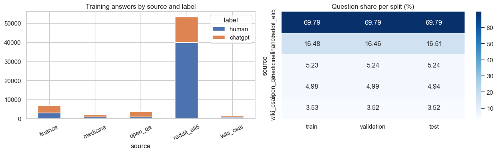
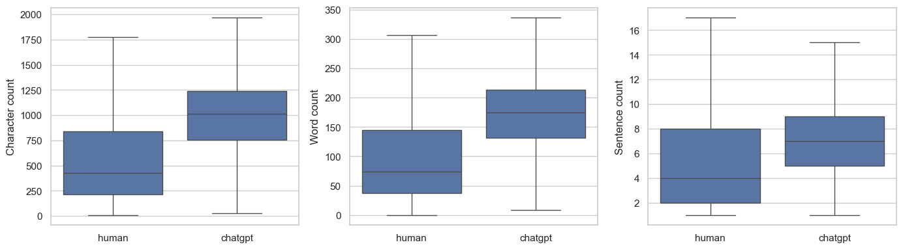
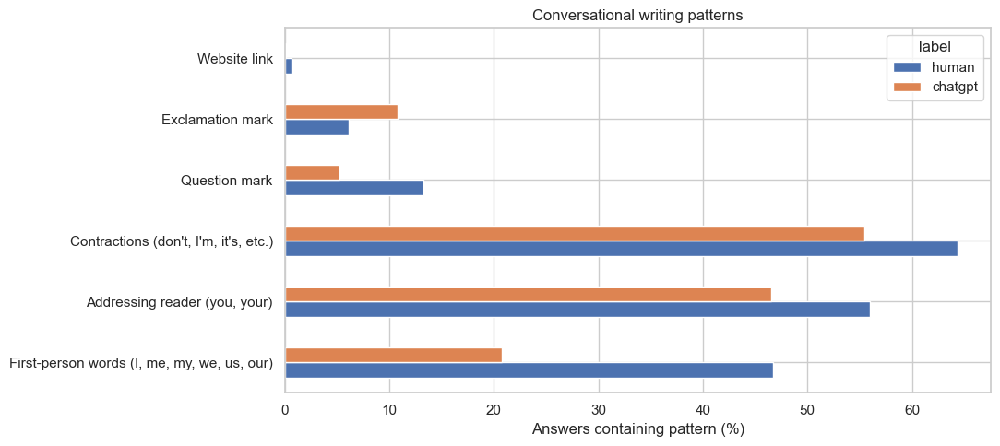
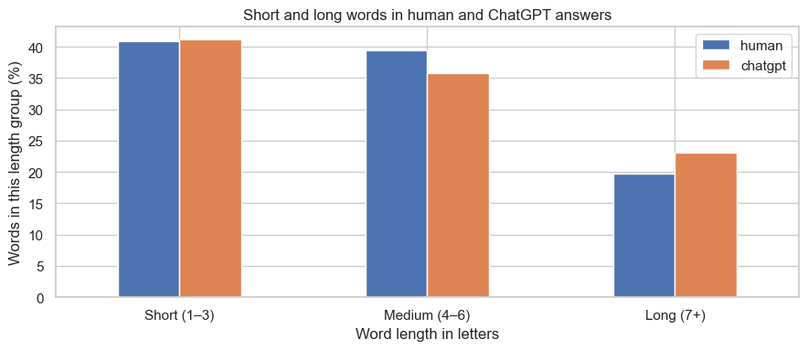

# Spot the Bot- Detecting AI Generated Text

This project explores how to distinguish human-written text from ChatGPT-generated text using the HC3 dataset. We compare answer length, vocabulary, punctuation, and writing patterns to understand the data before building a text classifier.

---

### 👥 **Team Members**

**Example:**

| Name              | GitHub Handle   | Contribution                                                             |
|-------------------|-----------------|--------------------------------------------------------------------------|
| Abdulahi Oyebanji | @abdulahi-banji |                                                                          |
| Austin Xu         | @austxu         |                                                                          |                                                                        |
| Matthew Han       | @matthewjyhan   |                                                                          |
| Angelina Yeh      | @AngelinaY17    |                                                                          |
| Leah Torres       | @lctorr         |                                                                          |
| Allyson Keightley | @akeight        |                                                                          |
| Brian Casio       | @briancasio     |                                                                          |

---

## 🎯 **Project Highlights**

**Example:**

- Developed a machine learning model using `[model type/technique]` to address `[challenge project task]`.
- Achieved `[key metric or result]`, demonstrating `[value or impact]` for `[host company]`.
- Generated actionable insights to inform business decisions at `[host company or stakeholders]`.
- Implemented `[specific methodology]` to address industry constraints or expectations.

---

## 👩🏽‍💻 **Setup and Installation**

**Provide step-by-step instructions so someone else can run your code and reproduce your results. Depending on your setup, include:**

* How to clone the repository
* How to install dependencies
* How to set up the environment
* How to access the dataset(s)
* How to run the notebook or scripts

---

## 🏗️ **Project Overview**

**Describe:**

- How this project is connected to the Break Through Tech AI Program
- Your AI Studio host company and the project objective and scope
- The real-world significance of the problem and the potential impact of your work

---

## 📊 **Data Exploration**

Our [EDA notebook](notebooks/eda.ipynb) analyzes **67,232 training answers** from the updated HC3 cleaning and splitting pipeline. Here are some of the charts from our exploration.

**Dataset balance:** human answers make up about 68% of training, and Reddit ELI5 is the largest domain.

**Answer length:** human answers have a median of 74 words, compared with 175 for ChatGPT. This helps us check whether a detector might rely too much on length.

**Writing style:** we compare personal language, contractions, questions, exclamations, and links as possible clues for the detector.

**Word length:** this chart compares the proportion of short, medium, and long words in each class.

These patterns describe our dataset; no single pattern proves that an answer was written by AI.

---

## 🧠 **Model Development**

**You might consider describing the following (as applicable):**

* Model(s) used (e.g., CNN with transfer learning, regression models)
* Feature selection and Hyperparameter tuning strategies
* Training setup (e.g., % of data for training/validation, evaluation metric, baseline performance)

---

## 📈 **Results & Key Findings**

**You might consider describing the following (as applicable):**

* Performance metrics (e.g., Accuracy, F1 score, RMSE)
* How your model performed
* Insights from evaluating model fairness

**Potential visualizations to include:**

* Confusion matrix, precision-recall curve, feature importance plot, prediction distribution, outputs from fairness or explainability tools

---

## 🚀 **Next Steps**

**You might consider addressing the following (as applicable):**

* What are some of the limitations of your model?
* What would you do differently with more time/resources?
* What additional datasets or techniques would you explore?

---

## 📝 **License**

Specify how your project can be used by others. Choose an appropriate license and link it here (e.g., MIT, Apache 2.0). Make sure your Challenge Advisor approves of the selected license type. 

**Example:**
This project is licensed under the MIT License.

---

## 📄 **References** (Optional but encouraged)

Cite relevant papers, articles, or resources that supported your project.

---

## 🙏 **Acknowledgements** (Optional but encouraged)

Thank your Challenge Advisor, host company representatives, TA, and others who supported your project.
